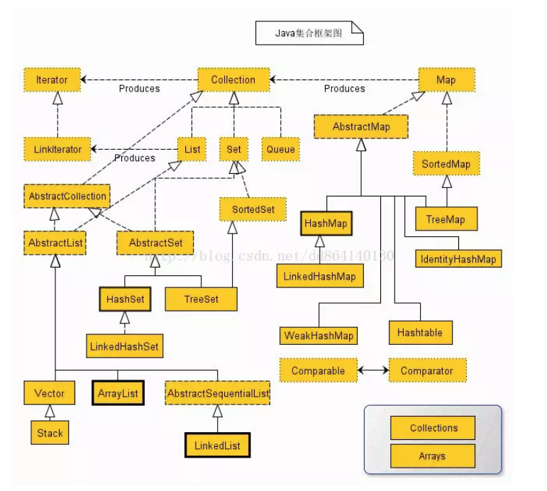

# 集合

## Java中的集合及其继承关系

关于集合的体系是每个人都应该烂熟于心的,尤其是对我们经常使用的List,Map的原理更该如此.这里我们看这张图即可:



## List、Set、Map是否继承自Collection接口？

List、Set 是，Map 不是。Map是键值对映射容器，与List和Set有明显的区别，而Set存储的零散的元素且不允许有重复元素（数学中的集合也是如此），List是线性结构的容器，适用于按数值索引访问元素的情形。

## 阐述ArrayList、Vector、LinkedList的存储性能和特性。

ArrayList 和Vector都是使用数组方式存储数据，此数组元素数大于实际存储的数据以便增加和插入元素，它们都允许直接按序号索引元素，但是插入元素要涉及数组元素移动等内存操作，所以索引数据快而插入数据慢。Vector中的方法由于添加了synchronized修饰，因此Vector是线程安全的容器，但性能上较ArrayList差，因此已经是Java中的遗留容器。

LinkedList使用双向链表实现存储（将内存中零散的内存单元通过附加的引用关联起来，形成一个可以按序号索引的线性结构，这种链式存储方式与数组的连续存储方式相比，内存的利用率更高），按序号索引数据需要进行前向或后向遍历，但是插入数据时只需要记录本项的前后项即可，所以插入速度较快。

Vector属于遗留容器（Java早期的版本中提供的容器，除此之外，Hashtable、Dictionary、BitSet、Stack、Properties都是遗留容器），已经不推荐使用，但是由于ArrayList和LinkedListed都是非线程安全的，如果遇到多个线程操作同一个容器的场景，则可以通过工具类Collections中的synchronizedList方法将其转换成线程安全的容器后再使用（这是对装潢模式的应用，将已有对象传入另一个类的构造器中创建新的对象来增强实现）。

## Collection和Collections的区别？

Collection是一个接口，它是Set、List等容器的父接口；Collections是个一个工具类，提供了一系列的静态方法来辅助容器操作，这些方法包括对容器的搜索、排序、线程安全化等等。

## List、Map、Set三个接口存取元素时，各有什么特点？

List以特定索引来存取元素，可以有重复元素。

Set不能存放重复元素（用对象的equals()方法来区分元素是否重复）。

Map保存键值对（key-value pair）映射，映射关系可以是一对一或多对一。

Set和Map容器都有基于哈希存储和排序树的两种实现版本，基于哈希存储的版本理论存取时间复杂度为O(1)，而基于排序树版本的实现在插入或删除元素时会按照元素或元素的键（key）构成排序树从而达到排序和去重的效果。

## poll()方法和remove()方法区别？

poll() 和 remove() 都是从队列中取出一个元素，但是 poll() 在获取元素失败的时候会返回空，但是 remove() 失败的时候会抛出异常。

## List 和 Set 区别

Set是最简单的一种集合。集合中的对象不按特定的方式排序，并且没有重复对象。

- HashSet： HashSet类按照哈希算法来存取集合中的对象，存取速度比较快
- TreeSet ：TreeSet类实现了SortedSet接口，能够对集合中的对象进行排序。

List的特征是其元素以线性方式存储，集合中可以存放重复对象。

- ArrayList() : 代表长度可以改变得数组。可以对元素进行随机的访问，向ArrayList()中插入与删除元素的速度慢。
- LinkedList(): 在实现中采用链表数据结构。插入和删除速度快，访问速度慢。

## LinkedHashMap和PriorityQueue的区别

PriorityQueue 是一个优先级队列,保证最高或者最低优先级的的元素总是在队列头部，但是 LinkedHashMap 维持的顺序是元素插入的顺序。当遍历一个 PriorityQueue 时，没有任何顺序保证，但是 LinkedHashMap 课保证遍历顺序是元素插入的顺序。

## WeakHashMap与HashMap的区别是什么？

WeakHashMap 的工作与正常的 HashMap 类似，但是使用弱引用作为 key，意思就是当 key 对象没有任何引用时，key/value 将会被回收。

## ArrayList和LinkedList的区别？

最明显的区别是 ArrrayList底层的数据结构是数组，支持随机访问，而 LinkedList 的底层数据结构是双向循环链表，不支持随机访问。使用下标访问一个元素，ArrayList 的时间复杂度是 O(1)，而 LinkedList 是 O(n)。

相对于ArrayList，LinkedList的插入，添加，删除操作速度更快，因为当元素被添加到集合任意位置的时候，不需要像数组那样重新计算大小或者是更新索引。

LinkedList比ArrayList更占内存，因为LinkedList为每一个节点存储了两个引用，一个指向前一个元素，一个指向下一个元素。

## ArrayList和Array有什么区别？

Array可以容纳基本类型和对象，而ArrayList只能容纳对象。

Array是指定大小的，而ArrayList大小是固定的

## ArrayList 与 Vector 区别

ArrayList和Vector在很多时候都很类似。

- 两者都是基于索引的，内部由一个数组支持。
- 两者维护插入的顺序，我们可以根据插入顺序来获取元素。
- ArrayList和Vector的迭代器实现都是fail-fast的。
- ArrayList和Vector两者允许null值，也可以使用索引值对元素进行随机访问。

以下是ArrayList和Vector的不同点。

- Vector是同步的，而ArrayList不是。然而，如果你寻求在迭代的时候对列表进行改变，你应该使用CopyOnWriteArrayList。
- ArrayList比Vector快，它因为有同步，不会过载。
- ArrayList更加通用，因为我们可以使用Collections工具类轻易地获取同步列表和只读列表。

## HashMap 和 Hashtable 的区别

HashMap和Hashtable都实现了Map接口，因此很多特性非常相似。但是，他们有以下不同点：

- HashMap允许键和值是null，而Hashtable不允许键或者值是null。
- Hashtable是同步的，而HashMap不是。因此，HashMap更适合于单线程环境，而Hashtable适合于多线程环境。
- HashMap提供了可供应用迭代的键的集合，因此，HashMap是快速失败的。另一方面，Hashtable提供了对键的列举(Enumeration)。
- 一般认为Hashtable是一个遗留的类。

## HashSet 和 HashMap 区别

- HashSet实现了Set接口，它不允许集合中有重复的值。它存储的是对象
- HashMap实现了Map接口，Map接口对键值对进行映射。Map中不允许重复的键。Map接口有两个基本的实现，HashMap和TreeMap。

## HashMap 和 ConcurrentHashMap 的区别

- ConcurrentHashMap对整个桶数组进行了分段，而HashMap则没有。
- ConcurrentHashMap在每一个分段上都用锁进行保护，从而让锁的粒度更精细一些，并发性能更好，而HashMap没有锁机制，不是线程安全的。

引入ConcurrentHashMap是为了在同步集合HashTable之间有更好的选择，HashTable与HashMap、ConcurrentHashMap主要的区别在于HashMap不是同步的、线程不安全的和不适合应用于多线程并发环境下，而ConcurrentHashMap是线程安全的集合容器，特别是在多线程和并发环境中，通常作为Map的主要实现。

## ArrayList和HashMap默认大小？

在 Java 7 中，ArrayList 的默认大小是 10 个元素，HashMap 的默认大小是16个元素（必须是2的幂）。这就是 Java 7 中 ArrayList 和 HashMap 类的代码片段

```Java
private static final int DEFAULT_CAPACITY = 10;

//from HashMap.java JDK 7
static final int DEFAULT_INITIAL_CAPACITY = 1 << 4; // aka 16
```

## Comparator和Comparable的区别？

Comparable 接口用于定义对象的自然顺序，而 comparator 通常用于定义用户定制的顺序。Comparable 总是只有一个，但是可以有多个 comparator 来定义对象的顺序。

## 如何实现集合排序？

你可以使用有序集合，如 TreeSet 或 TreeMap，你也可以使用有顺序的的集合，如 list，然后通过 Collections.sort() 来排序。

## 如何打印数组内容

你可以使用 Arrays.toString() 和 Arrays.deepToString() 方法来打印数组。由于数组没有实现 toString() 方法，所以如果将数组传递给 System.out.println() 方法，将无法打印出数组的内容，但是 Arrays.toString() 可以打印每个元素。

## LinkedList的是单向链表还是双向？

双向循环列表,具体实现自行查阅源码.

## TreeMap是实现原理

采用红黑树实现,具体实现自行查阅源码.

## 遍历ArrayList时如何正确移除一个元素

该问题的关键在于面试者使用的是 ArrayList 的 remove() 还是 Iterator 的 remove()方法。这有一段示例代码，是使用正确的方式来实现在遍历的过程中移除元素，而不会出现 ConcurrentModificationException 异常的示例代码。

## 什么是ArrayMap？它和HashMap有什么区别？

ArrayMap是Android SDK中提供的,非Android开发者可以略过。

ArrayMap是用两个数组来模拟map,更少的内存占用空间,更高的效率。

具体参考这篇文章:ArrayMap VS HashMap：`http://lvable.com/?p=217%5D`

## 如何决定选用HashMap还是TreeMap？

对于在Map中插入、删除和定位元素这类操作，HashMap是最好的选择。然而，假如你需要对一个有序的key集合进行遍历，TreeMap是更好的选择。基于你的collection的大小，也许向HashMap中添加元素会更快，将map换为TreeMap进行有序key的遍历。

## HashMap的实现原理

1. HashMap概述： HashMap是基于哈希表的Map接口的非同步实现。此实现提供所有可选的映射操作，并允许使用null值和null键。此类不保证映射的顺序，特别是它不保证该顺序恒久不变。
1. HashMap的数据结构： 在java编程语言中，最基本的结构就是两种，一个是数组，另外一个是模拟指针（引用），所有的数据结构都可以用这两个基本结构来构造的，HashMap也不例外。HashMap实际上是一个“链表散列”的数据结构，即数组和链表的结合体。

当我们往Hashmap中put元素时,首先根据key的hashcode重新计算hash值,根绝hash值得到这个元素在数组中的位置(下标),如果该数组在该位置上已经存放了其他元素,那么在这个位置上的元素将以链表的形式存放,新加入的放在链头,最先加入的放入链尾.如果数组中该位置没有元素,就直接将该元素放到数组的该位置上.

需要注意Jdk 1.8中对HashMap的实现做了优化,当链表中的节点数据超过八个之后,该链表会转为红黑树来提高查询效率,从原来的O(n)到O(logn)

## ConcurrentHashMap 的工作原理及代码实现

ConcurrentHashMap具体是怎么实现线程安全的呢，肯定不可能是每个方法加synchronized，那样就变成了HashTable。

从ConcurrentHashMap代码中可以看出，它引入了一个“分段锁”的概念，具体可以理解为把一个大的Map拆分成N个小的HashTable，根据key.hashCode()来决定把key放到哪个HashTable中。

在ConcurrentHashMap中，就是把Map分成了N个Segment，put和get的时候，都是现根据key.hashCode()算出放到哪个Segment中。

## 你了解Fail-Fast机制吗

Fail-Fast即我们常说的快速失败,

更多内容参看fail-fast机制：`http://blog.csdn.net/chenssy/article/details/38151189`

## Fail-fast和Fail-safe有什么区别

Iterator的fail-fast属性与当前的集合共同起作用，因此它不会受到集合中任何改动的影响。Java.util包中的所有集合类都被设计为fail->fast的，而java.util.concurrent中的集合类都为fail-safe的。当检测到正在遍历的集合的结构被改变时，Fail-fast迭代器抛出ConcurrentModificationException，而fail-safe迭代器从不抛出ConcurrentModificationException。

## 说出几点 Java 中使用 Collections 的最佳实践

这是我在使用 Java 中 Collectionc 类的一些最佳实践：

- 使用正确的集合类，例如，如果不需要同步列表，使用 ArrayList 而不是 Vector。
- 优先使用并发集合，而不是对集合进行同步。并发集合提供更好的可扩展性。
- 使用接口代表和访问集合，如使用List存储 ArrayList，使用 Map 存储 HashMap 等等。
- 使用迭代器来循环集合。
- 使用集合的时候使用泛型。

## BlockingQueue是什么？

Java.util.concurrent.BlockingQueue是一个队列，在进行检索或移除一个元素的时候，它会等待队列变为非空；当在添加一个元素时，它会等待队列中的可用空间。BlockingQueue接口是Java集合框架的一部分，主要用于实现生产者-消费者模式。我们不需要担心等待生产者有可用的空间，或消费者有可用的对象，因为它都在BlockingQueue的实现类中被处理了。Java提供了集中BlockingQueue的实现，比如ArrayBlockingQueue、LinkedBlockingQueue、PriorityBlockingQueue,、SynchronousQueue

## 队列和栈是什么，列出它们的区别？

栈和队列两者都被用来预存储数据。java.util.Queue是一个接口，它的实现类在Java并发包中。队列允许先进先出（FIFO）检索元素，但并非总是这样。Deque接口允许从两端检索元素。

栈与队列很相似，但它允许对元素进行后进先出（LIFO）进行检索。

Stack是一个扩展自Vector的类，而Queue是一个接口。