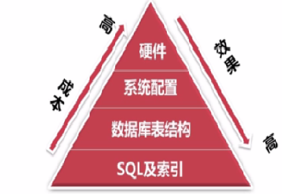
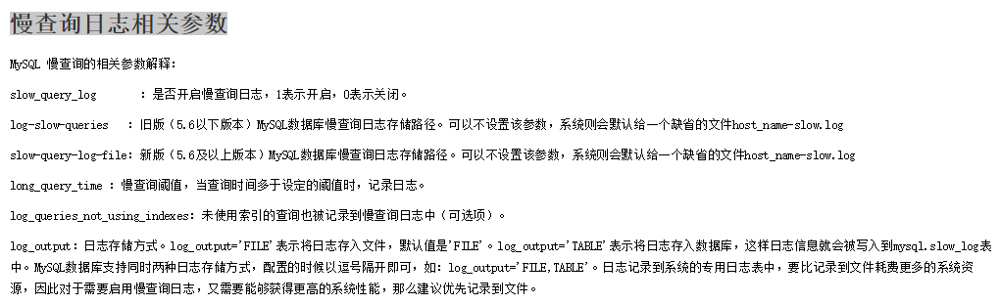

# MySQL

## 实践中如何优化MySQL

实践中，MySQL的优化主要涉及SQL语句及索引的优化、数据表结构的优化、系统配置的优化和硬件的优化四个方面，如下图所示：



### SQL语句及索引的优化

#### SQL语句的优化

SQL语句的优化主要包括三个问题，即如何发现有问题的SQL、如何分析SQL的执行计划以及如何优化SQL，下面将逐一解释。

1. 怎么发现有问题的SQL?（通过MySQL慢查询日志对有效率问题的SQL进行监控）

MySQL的慢查询日志是MySQL提供的一种日志记录，它用来记录在MySQL中响应时间超过阀值的语句，具体指运行时间超过long_query_time值的SQL，则会被记录到慢查询日志中。

long_query_time的默认值为10，意思是运行10s以上的语句。慢查询日志的相关参数如下所示：



通过MySQL的慢查询日志，我们可以查询出执行的次数多占用的时间长的SQL、可以通过pt_query_disgest(一种mysql慢日志分析工具)分析Rows examine(MySQL执行器需要检查的行数)项去找出IO大的SQL以及发现未命中索引的SQL，对于这些SQL，都是我们优化的对象。

##### 通过explain查询和分析SQL的执行计划

使用 EXPLAIN 关键字可以知道MySQL是如何处理你的SQL语句的，以便分析查询语句或是表结构的性能瓶颈。通过explain命令可以得到表的读取顺序、数据读取操作的操作类型、哪些索引可以使用、哪些索引被实际使用、表之间的引用以及每张表有多少行被优化器查询等问题。当扩展列extra出现Using filesort和Using temporay，则往往表示SQL需要优化了。

##### 优化SQL语句

- 优化insert语句：一次插入多值；
- 应尽量避免在 where 子句中使用!=或<>操作符，否则将引擎放弃使用索引而进行全表扫描；
- 应尽量避免在 where 子句中对字段进行null值判断，否则将导致引擎放弃使用索引而进行全表扫描；
- 优化嵌套查询：子查询可以被更有效率的连接(Join)替代；
- 很多时候用 exists 代替 in 是一个好的选择。

#### 索引优化

建议在经常作查询选择的字段、经常作表连接的字段以及经常出现在order by、group by、distinct 后面的字段中建立索引。但必须注意以下几种可能会引起索引失效的情形：

- 以“%(表示任意0个或多个字符)”开头的LIKE语句，模糊匹配；
- OR语句前后没有同时使用索引；
- 数据类型出现隐式转化（如varchar不加单引号的话可能会自动转换为int型）；
- 对于多列索引，必须满足最左匹配原则(eg,多列索引col1、col2和col3，则 索引生效的情形包括col1或col1，col2或col1，col2，col3)。

### 数据库表结构的优化

数据库表结构的优化包括选择合适数据类型、表的范式的优化、表的垂直拆分和表的水平拆分等手段。

#### 选择合适数据类型

- 使用较小的数据类型解决问题；
- 使用简单的数据类型(mysql处理int要比varchar容易)；
- 尽可能的使用not null 定义字段；
- 尽量避免使用text类型，非用不可时最好考虑分表；

#### 表的范式的优化

一般情况下，表的设计应该遵循三大范式。

#### 表的垂直拆分

- 把含有多个列的表拆分成多个表，解决表宽度问题，具体包括以下几种拆分手段：
- 把不常用的字段单独放在同一个表中；
- 把大字段独立放入一个表中；
- 把经常使用的字段放在一起；
- 这样做的好处是非常明显的，具体包括：拆分后业务清晰，拆分规则明确、系统之间整合或扩展容易、数据维护简单。

#### 表的水平拆分

表的水平拆分用于解决数据表中数据过大的问题，水平拆分每一个表的结构都是完全一致的。一般地，将数据平分到N张表中的常用方法包括以下两种：

- 对ID进行hash运算，如果要拆分成5个表，mod(id,5)取出0~4个值；
- 针对不同的hashID将数据存入不同的表中；
- 表的水平拆分会带来一些问题和挑战，包括跨分区表的数据查询、统计及后台报表的操作等问题，但也带来了一些切实的好处：

  - 表分割后可以降低在查询时需要读的数据和索引的页数，同时也降低了索引的层数，提高查询速度；
  - 表中的数据本来就有独立性，例如表中分别记录各个地区的数据或不同时期的数据，特别是有些数据常用，而另外一些数据不常用。

- 需要把数据存放到多个数据库中，提高系统的总体可用性(分库，鸡蛋不能放在同一个篮子里)。

### 系统配置的优化

操作系统配置的优化：增加TCP支持的队列数

mysql配置文件优化：Innodb缓存池设置(innodb_buffer_pool_size，推荐总内存的75%)和缓存池的个数（innodb_buffer_pool_instances）

### 硬件的优化

CPU：核心数多并且主频高的
内存：增大内存
磁盘配置和选择：磁盘性能

## MySQL中的悲观锁与乐观锁的实现

悲观锁与乐观锁是两种常见的资源并发锁设计思路，也是并发编程中一个非常基础的概念。

### 悲观锁

悲观锁的特点是先获取锁，再进行业务操作，即“悲观”的认为所有的操作均会导致并发安全问题，因此要先确保获取锁成功再进行业务操作。通常来讲，在数据库上的悲观锁需要数据库本身提供支持，即通过常用的select … for update操作来实现悲观锁。当数据库执行select … for update时会获取被select中的数据行的行锁，因此其他并发执行的select … for update如果试图选中同一行则会发生排斥（需要等待行锁被释放），因此达到锁的效果。select for update获取的行锁会在当前事务结束时自动释放，因此必须在事务中使用。
　　
这里需要特别注意的是，不同的数据库对select… for update的实现和支持都是有所区别的，例如oracle支持select for update no wait，表示如果拿不到锁立刻报错，而不是等待，mysql就没有no wait这个选项。另外，mysql还有个问题是: select… for update语句执行中所有扫描过的行都会被锁上，这一点很容易造成问题。因此，如果在mysql中用悲观锁务必要确定使用了索引，而不是全表扫描。

### 乐观锁

乐观锁的特点先进行业务操作，只在最后实际更新数据时进行检查数据是否被更新过，若未被更新过，则更新成功；否则，失败重试。乐观锁在数据库上的实现完全是逻辑的，不需要数据库提供特殊的支持。一般的做法是在需要锁的数据上增加一个版本号或者时间戳，然后按照如下方式实现：

```sql
SELECT data AS old_data, version AS old_version FROM …;
//根据获取的数据进行业务操作，得到new_data和new_version
UPDATE SET data = new_data, version = new_version WHERE version = old_version
if (updated row > 0) {
// 乐观锁获取成功，操作完成
} else {
// 乐观锁获取失败，回滚并重试
}
```

乐观锁是否在事务中其实都是无所谓的，其底层机制是这样：在数据库内部update同一行的时候是不允许并发的，即数据库每次执行一条update语句时会获取被update行的写锁，直到这一行被成功更新后才释放。因此在业务操作进行前获取需要锁的数据的当前版本号，然后实际更新数据时再次对比版本号确认与之前获取的相同，并更新版本号，即可确认这其间没有发生并发的修改。如果更新失败，即可认为老版本的数据已经被并发修改掉而不存在了，此时认为获取锁失败，需要回滚整个业务操作并可根据需要重试整个过程。

### 悲观锁与乐观锁的应用场景

一般情况下，读多写少更适合用乐观锁，读少写多更适合用悲观锁。乐观锁在不发生取锁失败的情况下开销比悲观锁小，但是一旦发生失败回滚开销则比较大，因此适合用在取锁失败概率比较小的场景，可以提升系统并发性能。

## MySQL存储引擎中的MyISAM和InnoDB区别详解

在MySQL 5.5之前，MyISAM是mysql的默认数据库引擎，其由早期的ISAM（Indexed Sequential Access Method：有索引的顺序访问方法）所改良。虽然MyISAM性能极佳，但却有一个显著的缺点： 不支持事务处理。不过，MySQL也导入了另一种数据库引擎InnoDB，以强化参考完整性与并发违规处理机制，后来就逐渐取代MyISAM。

InnoDB是MySQL的数据库引擎之一，其由Innobase oy公司所开发，2006年五月由甲骨文公司并购。与传统的ISAM、MyISAM相比，InnoDB的最大特色就是支持ACID兼容的事务功能，类似于PostgreSQL。目前InnoDB采用双轨制授权，一是GPL授权，另一是专有软件授权。具体地，MyISAM与InnoDB作为MySQL的两大存储引擎的差异主要包括：

存储结构：每个MyISAM在磁盘上存储成三个文件：第一个文件的名字以表的名字开始，扩展名指出文件类型。.frm文件存储表定义，数据文件的扩展名为.MYD (MYData)，索引文件的扩展名是.MYI (MYIndex)。InnoDB所有的表都保存在同一个数据文件中（也可能是多个文件，或者是独立的表空间文件），InnoDB表的大小只受限于操作系统文件的大小，一般为2GB。

存储空间：MyISAM可被压缩，占据的存储空间较小，支持静态表、动态表、压缩表三种不同的存储格式。InnoDB需要更多的内存和存储，它会在主内存中建立其专用的缓冲池用于高速缓冲数据和索引。

可移植性、备份及恢复：MyISAM的数据是以文件的形式存储，所以在跨平台的数据转移中会很方便，同时在备份和恢复时也可单独针对某个表进行操作。InnoDB免费的方案可以是拷贝数据文件、备份 binlog，或者用 mysqldump，在数据量达到几十G的时候就相对痛苦了。

事务支持：MyISAM强调的是性能，每次查询具有原子性，其执行数度比InnoDB类型更快，但是不提供事务支持。InnoDB提供事务、外键等高级数据库功能，具有事务提交、回滚和崩溃修复能力。

AUTO_INCREMENT：在MyISAM中，可以和其他字段一起建立联合索引。引擎的自动增长列必须是索引，如果是组合索引，自动增长可以不是第一列，它可以根据前面几列进行排序后递增。InnoDB中必须包含只有该字段的索引，并且引擎的自动增长列必须是索引，如果是组合索引也必须是组合索引的第一列。

表锁差异：MyISAM只支持表级锁，用户在操作MyISAM表时，select、update、delete和insert语句都会给表自动加锁，如果加锁以后的表满足insert并发的情况下，可以在表的尾部插入新的数据。InnoDB支持事务和行级锁。行锁大幅度提高了多用户并发操作的新能，但是InnoDB的行锁，只是在WHERE的主键是有效的，非主键的WHERE都会锁全表的。

全文索引：MyISAM支持 FULLTEXT类型的全文索引；InnoDB不支持FULLTEXT类型的全文索引，但是innodb可以使用sphinx插件支持全文索引，并且效果更好。

表主键：MyISAM允许没有任何索引和主键的表存在，索引都是保存行的地址。对于InnoDB，如果没有设定主键或者非空唯一索引，就会自动生成一个6字节的主键(用户不可见)，数据是主索引的一部分，附加索引保存的是主索引的值。

表的具体行数：MyISAM保存表的总行数，select count() from table;会直接取出出该值；而InnoDB没有保存表的总行数，如果使用select count() from table；就会遍历整个表，消耗相当大，但是在加了wehre条件后，myisam和innodb处理的方式都一样。

CURD操作：在MyISAM中，如果执行大量的SELECT，MyISAM是更好的选择。对于InnoDB，如果你的数据执行大量的INSERT或UPDATE，出于性能方面的考虑，应该使用InnoDB表。DELETE从性能上InnoDB更优，但DELETE FROM table时，InnoDB不会重新建立表，而是一行一行的删除，在innodb上如果要清空保存有大量数据的表，最好使用truncate table这个命令。

外键：MyISAM不支持外键，而InnoDB支持外键。

通过上述的分析，基本上可以考虑使用InnoDB来替代MyISAM引擎了，原因是InnoDB自身很多良好的特点，比如事务支持、存储过程、视图、行级锁、外键等等。尤其在并发很多的情况下，相信InnoDB的表现肯定要比MyISAM强很多。另外，必须需要注意的是，任何一种表都不是万能的，合适的才是最好的，才能最大的发挥MySQL的性能优势。如果是不复杂的、非关键的Web应用，还是可以继续考虑MyISAM的，这个具体情况具体考虑。

MyISAM：不支持事务，不支持外键，表锁；插入数据时锁定整个表，查行数时无需整表扫描。主索引数据文件和索引文件分离；与主索引无区别；

InnoDB：支持事务，外键，行锁，查表总行数时，全表扫描；主索引的数据文件本身就是索引文件；辅助索引记录主键的值；

## MySQL锁类型　　

根据锁的类型分，可以分为共享锁，排他锁，意向共享锁和意向排他锁。

根据锁的粒度分，又可以分为行锁，表锁。

对于mysql而言，事务机制更多是靠底层的存储引擎来实现，因此，mysql层面只有表锁，而支持事务的innodb存 储引擎则实现了行锁(记录锁（在行相应的索引记录上的锁）)，gap锁（是在索引记录间歇上的锁），next-key锁（是记录锁和在此索引记录之前的gap上的锁的结合）。Mysql的记录锁实质是索引记录的锁，因为innodb是索引组织表；gap锁是索引记录间隙的锁，这种锁只在RR隔离级别下有效；next-key锁是记录锁加上记录之前gap锁的组合。mysql通过gap锁和next-key锁实现RR隔离级别。

说明：对于更新操作(读不上锁)，只有走索引才可能上行锁；否则会对聚簇索引的每一行上写锁，实际等同于对表上写锁。
　　
若多个物理记录对应同一个索引，若同时访问，也会出现锁冲突；

当表有多个索引时，不同事务可以用不同的索引锁住不同的行，另外innodb会同时用行锁对数据记录(聚簇索引)加锁。

MVCC(多版本并发控制)并发控制机制下，任何操作都不会阻塞读操作，读操作也不会阻塞任何操作，只因为读不上锁。
　　
共享锁：由读表操作加上的锁，加锁后其他用户只能获取该表或行的共享锁，不能获取排它锁，也就是说只能读不能写

排它锁：由写表操作加上的锁，加锁后其他用户不能获取该表或行的任何锁，典型是mysql事务中的更新操作。

意向共享锁（IS）：事务打算给数据行加行共享锁，事务在给一个数据行加共享锁前必须先取得该表的IS锁。

意向排他锁（IX）：事务打算给数据行加行排他锁，事务在给一个数据行加排他锁前必须先取得该表的IX锁。

## 数据库死锁概念

多数情况下，可以认为如果一个资源被锁定，它总会在以后某个时间被释放。而死锁发生在当多个进程访问同一数据库时，其中每个进程拥有的锁都是其他进程所需的，由此造成每个进程都无法继续下去。简单的说，进程A等待进程B释放他的资源，B又等待A释放他的资源，这样就互相等待就形成死锁。

虽然进程在运行过程中，可能发生死锁，但死锁的发生也必须具备一定的条件，死锁的发生必须具备以下四个必要条件：

1）互斥条件：指进程对所分配到的资源进行排它性使用，即在一段时间内某资源只由一个进程占用。如果此时还有其它进程请求资源，则请求者只能等待，直至占有资源的进程用毕释放。
　　
2）请求和保持条件：指进程已经保持至少一个资源，但又提出了新的资源请求，而该资源已被其它进程占有，此时请求进程阻塞，但又对自己已获得的其它资源保持不放。
　　
3）不剥夺条件：指进程已获得的资源，在未使用完之前，不能被剥夺，只能在使用完时由自己释放。
　　
4）环路等待条件：指在发生死锁时，必然存在一个进程——资源的环形链，即进程集合{P0，P1，P2，•••，Pn}中的P0正在等待一个P1占用的资源；P1正在等待P2占用的资源，……，Pn正在等待已被P0占用的资源。
　　
下列方法有助于最大限度地降低死锁：

- 按同一顺序访问对象。
- 避免事务中的用户交互。
- 保持事务简短并在一个批处理中。
- 使用低隔离级别。
- 使用绑定连接。

## 千万级MySQL数据库建立索引的事项及提高性能的手段

1. 对查询进行优化，应尽量避免全表扫描，首先应考虑在 where 及 order by 涉及的列上建立索引。
1. 应尽量避免在 where 子句中对字段进行 null 值判断，否则将导致引擎放弃使用索引而进行全表扫描，如：select id from t where num is null可以在num上设置默认值0，确保表中num列没有null值，然后这样查询：select id from t where num=0
1. 应尽量避免在 where 子句中使用!=或<>操作符，否则引擎将放弃使用索引而进行全表扫描。
1. 应尽量避免在 where 子句中使用or 来连接条件，否则将导致引擎放弃使用索引而进行全表扫描，如：select id from t where num=10 or num=20可以这样查询：select id from t where num=10 union all select id from t where num=20
1. in 和 not in 也要慎用，否则会导致全表扫描，如：select id from t where num in(1,2,3) 对于连续的数值，能用 between 就不要用 in 了：select id from t where num between 1 and 3
1. 避免使用通配符。下面的查询也将导致全表扫描：select id from t where name like ‘李%’若要提高效率，可以考虑全文检索。
1. 如果在 where 子句中使用参数，也会导致全表扫描。因为SQL只有在运行时才会解析局部变量，但优化程序不能将访问计划的选择推迟到运行时；它必须在编译时进行选择。然而，如果在编译时建立访问计划，变量的值还是未知的，因而无法作为索引选择的输入项。如下面语句将进行全表扫描：select id from t where num=@num可以改为强制查询使用索引：select id from t with(index(索引名)) where num=@num
1. 应尽量避免在 where 子句中对字段进行表达式操作，这将导致引擎放弃使用索引而进行全表扫描。如：select id from t where num/2=100应改为:select id from t where num=100*2
1. 应尽量避免在where子句中对字段进行函数操作，这将导致引擎放弃使用索引而进行全表扫描。如：select id from t where substring(name,1,3)=’abc’ ，name以abc开头的id应改为:select id from t where name like ‘abc%’
1. 不要在 where 子句中的“=”左边进行函数、算术运算或其他表达式运算，否则系统将可能无法正确使用索引。
1. 在使用索引字段作为条件时，如果该索引是复合索引，那么必须使用到该索引中的第一个字段作为条件时才能保证系统使用该索引，否则该索引将不会被使用，并且应尽可能的让字段顺序与索引顺序相一致。
1. 不要写一些没有意义的查询，如需要生成一个空表结构：select col1,col2 into #t from t where 1=0 这类代码不会返回任何结果集，但是会消耗系统资源的，应改成这样：create table #t(…)
1. 很多时候用 exists 代替 in 是一个好的选择：select num from a where num in(select num from b)用下面的语句替换：select num from a where exists(select 1 from b where num=a.num)
1. 并不是所有索引对查询都有效，SQL是根据表中数据来进行查询优化的，当索引列有大量数据重复时，SQL查询可能不会去利用索引，如一表中有字段sex，male、female几乎各一半，那么即使在sex上建了索引也对查询效率起不了作用。
1. 索引并不是越多越好，索引固然可以提高相应的 select 的效率，但同时也降低了insert 及 update 的 效率，因为 insert 或 update 时有可能会重建索引，所以怎样建索引需要慎重考虑，视具体情况而定。一个表的索引数最好不要超过6个，若太多则应考虑一些不常使用到的列上建的索引是否有 必要。
1. 应尽可能的避免更新 clustered 索引数据列，因为 clustered 索引数据列的顺序就是表记录的物理存储 顺序，一旦该列值改变将导致整个表记录的顺序的调整，会耗费相当大的资源。若应用系统需要频繁更新 clustered 索引数据列，那么需要考虑是否应将该索引建为 clustered 索引。
1. 尽量使用数字型字段，若只含数值信息的字段尽量不要设计为字符型，这会降低查询和连接的性能，并会增加存储开销。这是因为引擎在处理查询和连接时会逐个比较字符串中每一个字符，而对于数字型而言只需要比较一次就够了。
1. 尽可能的使用 varchar/nvarchar 代替 char/nchar ，因为首先变长字段存储空间小，可以节省存储空间，其次对于查询来说，在一个相对较小的字段内搜索效率显然要高些。
1. 任何地方都不要使用 select \* from t ，用具体的字段列表代替“\*”，不要返回用不到的任何字段。
1. 尽量使用表变量来代替临时表。如果表变量包含大量数据，请注意索引非常有限（只有主键索引）。
1. 避免频繁创建和删除临时表，以减少系统表资源的消耗。
1. 临时表并不是不可使用，适当地使用它们可以使某些例程更有效，例如，当需要重复引用大型表或常用表中的某个数据集时。但是，对于一次性事件，最好使用导出表。
1. 在新建临时表时，如果一次性插入数据量很大，那么可以使用 select into 代替 create table，避免造成大量 log ，以提高速度；如果数据量不大，为了缓和系统表的资源，应先create table，然后insert。
1. 如果使用到了临时表，在存储过程的最后务必将所有的临时表显式删除，先 truncate table ，然后 drop table ，这样可以避免系统表的较长时间锁定。
1. 尽量避免使用游标，因为游标的效率较差，如果游标操作的数据超过1万行，那么就应该考虑改写。
1. 使用基于游标的方法或临时表方法之前，应先寻找基于集的解决方案来解决问题，基于集的方法通常更有效。
1. 与临时表一样，游标并不是不可使用。对小型数据集使用 FAST_FORWARD 游标通常要优于其他逐行处理方法，尤其是在必须引用几个表才能获得所需的数据时。在结果集中包括“合计”的例程通常要比使用游标执行的速度快。如果开发时间允许，基于游标的方法和基于集的方法都可以尝试一下，看哪一种方法的效果更好。
1. 在所有的存储过程和触发器的开始处设置 SET NOCOUNT ON ，在结束时设置 SET NOCOUNT OFF。无需在执行存储过程和触发器的每个语句后向客户端发送DONE_IN_PROC 消息。
1. 尽量避免大事务操作，提高系统并发能力。
1. 尽量避免向客户端返回大数据量，若数据量过大，应该考虑相应需求是否合理。

## limit 20000 加载很慢怎么解决

## 树状结构的MYSQL存储